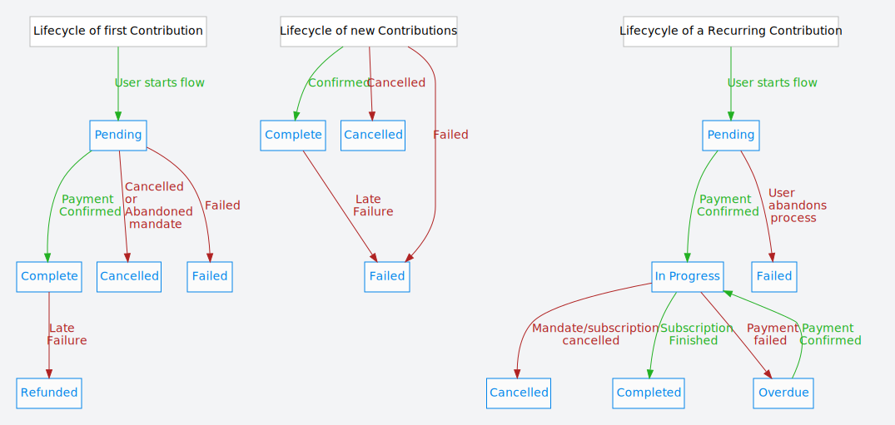

# GoCardless Direct Debit integration for CiviCRM

**A CiviCRM extension to GoCardless integration to handle UK
Direct Debits.**

This extension is working well for collecting regular weekly, monthly or yearly donations from UK supporters. Using it you can enable supporters to set up direct debits and every month when GoCardless takes payment this updates your CiviCRM contributions automatically. If someone cancels their Direct Debit this also updates your CiviCRM records. It also sends them a bunch of flowers thanking them for their support and asking them to reconsider their cancellation. Ok, it doesn't do that last bit.

[Artful Robot](https://artfulrobot.uk) stitches together open source websites and databases to help campaigns, charities, NGOs and other beautifully-minded people change the world. We specialise in CiviCRM and Drupal.

Other things to note

- Daily recurring is not supported by GoCardless, so you should not enable this option when configuring your forms. If you do users will get an error message: "Error Sorry, we are unable to set up your Direct Debit. Please call us."

- Taking one offs is [not supported/implemented yet](https://github.com/artfulrobot/uk.artfulrobot.civicrm.gocardless/issues/12).

- Generally worth scanning the titles of the [Issue Queue](https://github.com/artfulrobot/uk.artfulrobot.civicrm.gocardless/issues/)

- Developers can drive it from a non-CiviCRM form, e.g. if you have a highly custom donate form that does not use CiviCRM's payment pages.

- There are some phpunit tests. You only get these by cloning the repo, not by downloading a release .tgz or .zip. Do not run these on a live database!

- Pull Requests (PR) welcome. Please ensure all existing tests run OK before making a PR :-)

- You can pay me to fix/implement a feature you need [contact me](https://artfulrobot.uk/contact)

- If you use this, consider joining the friendly [chat channel](https://chat.civicrm.org/civicrm/channels/gocardless) for announcements and support.


## How to install

Choose option 1a (everyone) or 1b (developers only), then proceed with step 2.

### 0. Set up a GoCardless account

You'll need at least a *sandbox* (i.e. testing) account, so [register a sandbox account at GoCardless](https://manage-sandbox.gocardless.com/signup).

From within GoCardless's dashboard you'll need to **Create an access token**. Once you're logged in at GoCardless, go to Developers » Create » Access Token.

You want to choose **Read/Write**. Name it whatever you like.  Once you've created an access token a pop-up box will display the token. **You can never get to this again!** So make sure you copy it and store it safely somewhere for later use in your CiviCRM payment processor configuration.

You'll need to come back to the GoCardless control panel later on to set up your webhook.


### 1a. Install it the Simple way

This extension can be installed directly from within the CiviCRM user interface. See the user manual for details: [Installing extensions](https://docs.civicrm.org/user/en/latest/introduction/extensions/#installing-extensions).

Alternatively, visit the [Releases page](https://github.com/artfulrobot/uk.artfulrobot.civicrm.gocardless/releases) and download the code from there. Unzip it in your extensions directory and install in the CiviCRM Extensions screen in the usual way.

After you have installed it, follow instructions from [step 2 below](#createpp).

### 1b. Install it the Difficult way (developers)

The packaged version of this extension include the GoCardlessPro PHP libraries
and exclude some dev-only bits including the `bin`, `cli` and `tests`
directories.

This extension requires the GoCardlessPro PHP library. Here's how to install
from the \*nix command line. You need
[composer](https://getcomposer.org/download/).

    $ cd /path/to/your/extensions/dir
    $ git clone https://github.com/artfulrobot/uk.artfulrobot.civicrm.gocardless.git
    $ cd uk.artfulrobot.civicrm.gocardless
    $ which composer >/dev/null && composer install || echo You need composer, pls see https://getcomposer.org/download/ Then repeat this command. (i.e. composer install)

That should then bring in the GoCardlessPro dependency and you should be good to
go.

### <a name="createpp" id="createpp"></a> 2. Create a payment processor

Set up the payment processor:

- go to Administer » CiviContribute » Payment Processors then click **Add New**
- select **GoCardless** from the *Payment Processor Type*
- give it a name
- select **GoCardless Direct Debit** from the *Payment Method*
- add your access tokens (you obviously need a GoCardless account to do this)
- make up unique and secure webhook secrets
- click *Save*.

**Note: for testing purposes you may put your test/sandbox credentials (excluding webhook secret - see below) in the Live fields, but you must use CiviCRM's 'test drive' mode for trying payments; live mode will NOT work with test credentials since they are authenticated against different GoCardless API end points.** So your live testing will need to be with real-world live data.

### 3. Set up your webhook at GoCardless

GoCardless has full separation of its test (sandbox) and live account management pages, so **you'll do this twice**. Be sure to supply the webhook secret appropriate to the test/live environments - you **must** choose a different secret for live/test.

The webhook URL is at:

- Drupal: `/civicrm/gocardless/webhook`
- Wordpress `/?page=CiviCRM&q=civicrm/gocardless/webhook`
- Joomla: `/index.php?option=com_civicrm&task=civicrm/gocardless/webhook`

Note: the webhook will check the key twice; once against the test and once against the live payment processors' webhook secrets. From that information it determines whether it's a test or not. That's one reason you need different secrets.

**Note: a webhook is a web page; it's not something for you to view in your browser**. i.e. if you enter the webhook URL in your browser you *should* see a blank page. To find out whether it's working you'll need GoCardless to send it some data.

### 4. Use it and test it!

Create a contribution page and set up a regular donation using the "test-drive" page. Check things at CiviCRM's end and at GoCardless' end. Note that GoCardless keeps a log of whether webhooks were successful and gives you the chance to resubmit them, too, if I remember correctly.

Note: if you're running a "test-drive" contribution page you should use [GoCardless' test bank details](https://developer.gocardless.com/getting-started/developer-tools/test-bank-details/).

BACS details for UK:

* Sort code:`20-00-00` 
* Account number: `55779911`

Having set up a Direct Debit you should see that in the Contributions tab for your contact's record on CiviCRM, showing as a recurring payment, and also a pending contribution record. The date will be about a week in the future. Check your database several days after that date (GoCardless only knows something's been successful after the time for problems to be raised has expired, which is several working days) and the contribution should have been completed. Check your record next week/month/year and there should be another contribution automatically created.

## Pre-filling fields on the GoCardless hosted page

GoCardless can prepopulate some of the fields (address, phone, email). This is
useful in the cases when you have asked the user for this information as part of
the form you set up in CiviCRM because it saves them from having to enter it twice.

To use this feature just add the relevant fields to a CiviCRM Profile that you
are including in your contribution (etc) page.

Addresses, emails, phones all take a location type (Primary, Billing, Home,
Work...). If you have used more than one location type this plugin needs to
choose which to send to GoCardless. It picks fields using the following order of
preference:

1. Billing
2. Primary
3. anything

## Membership Dates

In a simple world, someone fills in a membership form, pays by credit card and
their membership is active immediately.

In the direct debit world, things happen on different dates:

1. `setup_date` - fill in a membership form, complete a direct debit mandate
   - Recurring Contribution created with status In Progress  
     `start_date = charge_date`
   - Contribution created with status Pending  
     `receive_date = charge_date`
   - Membership created with status Pending  
     `join_date`, `start_date`, `end_date` are blank

2. `charge_date` - first payment charged (4-5 working days later)

3. `webhook_date` - GoCardless fires webhook (one working day after the `charge_date`)

   - Contribution updated to status Completed

   - Membership updated to status New  
     `join_date = start_date = webhook_date`  
     `end_date = start_date + membership_length`

This appears to be identical date behaviour to creating a membership with a
pending cheque payment and then later recording the cheque as being received.
The membership will start when the payment is recorded and the contribution
status set to Completed. The end date is recalculated to be a year (or other
membership length) from the start date so that members get a full year of
benefit.

However... some might want the membership to start as soon as the mandate is
set up, before waiting for the first payment. The current date logic is handled
by core so this extension would need to override that in a couple of places to
implement a different scheme.  Since that is not specific to this payment
processor, it might be better to do this as an enhancement to core, or a
separate extension.

## Note on setting up memberships

The "Auto-renew" option is required for the GoCardless payment processor to
handle memberships.

If you use Price Sets and you have the "Auto renew option, not required"
selected then the user will not be shown the tick-box allowing them to select
Auto Renew, and this will break things. So better to use the straight forward
auto renew option rather than give an option that will break things.

Technical people might like to know that without this, CiviCRM creates a single
contribution and a membership record, but no `contribution_recur` record. This
causes a crash completing the redirect flow because it can't figure out the
interval (i.e. 1/year or such). It is possible to look that up from the
membership ID however that leads to the situation described above, and it's then
not clear what happens when the next payment comes in as it will not match up
with a `contribution_recur` record.

## Technical notes

GoCardless sends dozens of webhooks and this extension only reacts to the
following:

- payments: confirmed and failed.
- subscriptions: cancelled and finished.

The life-cycle would typically be:

1. User interacts with a CiviCRM Contribution form to set up regular
   contribution. On submitting the form the user is redirected to the GoCardless
   website after the following records are set up in CiviCRM:

     - a **pending** contribution
     - a **pending** recurring contribution

   Those records have receive and start date set (by core CiviCRM) to the date
   and time the form was submitted (as you might expect). However, once the user
   completes the page(s) on the GoCardless website they are redirected back to
   your website which completes the set up. On completion, the receive date of
   the contribution and the start date of the recurring contribution will have
   been set to a date **in the future**. This is the date provided by GoCardless
   itself and corresponds to the earliest date they can make a charge.

   Also, the recurring contribution record is now set to *In Progress*.

   The completion process sets up the following at GoCardless:

     - a **customer**
     - a **mandate**
     - a **subscription** - the ID of this begins with `SB` and is stored in the
       CiviCRM recurring contribution `trxn_id` and `processor_id` fields
     - a lot of scheduled **payments**


2. GoCardless submits the charge for a payment to the customer's bank and
   eventually (4-5 working days after creation) this is confirmed.
   It sends a webhook for `resource_type` `payments`, action `confirmed`. At
   this point the extension will:

     - look up the payment with GoCardless to obtain its subscription ID.
     - look up the CiviCRM recurring contribution record in CiviCRM from this
       subscription ID (which is stored in the transaction ID field)
     - find the pending CiviCRM contribution record that belongs to the
       recurring contribution and update it, setting status to **Completed**,
       setting the receive date to the **charge date** from GoCardless (n.b.
       this is earlier than the date this payment confirmed webhook fires) and
       setting the transaction ID to the GoCardless payment ID. It also sets
       amount to the amount from GoCardless.
     - check that the status on the CiviCRM recurring contribution
       record is 'In Progress'. (It should be, but the check is there because we
       previously did things differently.)

Note: the following working day the GoCardless payment status is changed from `confirmed` to
`paid_out`. Normally the confirmed webhook will have processed the payment
before this happens, but the extension will allow processing of payment
confirmed webhooks if the payment's status is `paid_out` too. This can be
helpful if there has been a problem with the webhook and you need to replay
some.

3. A week/month/year later GoCardless sends another confirmed payment. This time:

     - look up payment, get subscription ID. As before.
     - look up recurring contribution record from subscription ID. As before.
     - there is no 'pending' contribution now, so a new Completed one is
       created, copying details from the recurring contribution record.

4. Any failed payments work like confirmed ones but of course add or update
   Contributions with status `Failed` instead of `Completed`.

5. The Direct Debit ends with either cancelled or completed. Cancellations can
   be that the *subscription* is cancelled, or the *mandate* is cancelled. The latter would
   affect all subscriptions. Probably other things too, e.g. delete customer.
   GoCardless will cancel all pending payments and inform CiviCRM via webhook.
   GoCardless will then cancel the subscription and inform CiviCRM by webhook.
   Each of these updates the status of the contribution (payment) or recurring
   contribution (subscription) records.


## Developers: Importing from GoCardless

If you clone from the github repo, you'll see a cli directory. This contains a
script I used as a one-off to import some pre-existing GoCardless subscriptions.
It's not a fully fledged tool, but it may help others with one-off import tasks
to build a tool for their own needs from that.

## Change log

### 1.9.3 (unreleased)

- Reduce timeout for changing "Pending" recurring contributions to "Failed" from 24 hours to 0.66 hours. See [issue #76](https://github.com/artfulrobot/uk.artfulrobot.civicrm.gocardless/issues/76) You can still override this as a parameter, should you wish.

- developers: fixed problem getting and setting the processor ID in import script. Thanks @jmdh for this. Also, there's been a massive refactor of the import script.

### 1.9.2

- Move to `Payment.create` API instead of older (and deprecated) `Contribution.completetransaction` API.
   - This is from PR #70 (Thanks @mattwire) which fixes [issue #63](https://github.com/artfulrobot/uk.artfulrobot.civicrm.gocardless/issues/63) on some sites where the first contribution never gets completed.
   - Also this method is now used for repeat payments.

- Fix some issues with the system checks (PR #69 thanks @mattwire)

- Treat HTTP headers sent by GoCardless webhooks as case-insensitive, as now required by GoCardless (they changed the way they sent HTTP/1.1 headers).

- Fix missing/invalid configuration for payment instrument and payment method.

### 1.9 For CiviCRM 5.19+

- **Do not install v 1.9 from civicrm.org/extensions** - it's missing the important libraries! Use 1.9.1

- Supports changing the amount and cancelling a subscription via CiviCRM main user interface ([issue #6](https://github.com/artfulrobot/uk.artfulrobot.civicrm.gocardless/issues/6)). It does not support letting supporters themselves change these things.

- One-way-upgrade: we now store the GoCardless subscription ID in *both* `trxn_id` and `processor_id` in the `civicrm_contribution_recur` table. This is because some parts of CiviCRM's UI require us to reference the record via `processor_id` which was unused up to this point. An upgrade task should populate existing data.

- Some membership dates logic was failing in the tests under CiviCRM 5.19. This version passes its tests again.

- Fix issue when setting up a weekly membership ([issue #59](https://github.com/artfulrobot/uk.artfulrobot.civicrm.gocardless/issues/59) - thanks to MJW Consulting for reporting and suggesting fix)

- Improvements to code standards; better support for translation possibilities; move tests to phpunit6.

### 1.8 Big changes

- **Now with pictures** showing the lifecycle of Contribution and
  ContributionRecur records.  
  

- **Major change, possibly breaking**: multiple GoCardless payment processors
  now allowed. Previous versions had assumed a single GoCardless payment
  processor, and that's fine for most organisations. However, some organisations
  have cause to use multiple GoCardless accounts with one CiviCRM instance.

  **This change should hopefully be invisible to you and existing sites should
  continue to work as before**, with the **possible exception** of anyone who
  has done a custom (non-CiviCRM Contribution Page) donation form and used
  the GoCardless classes directly. If you have done this then you need to
  adjust your code, removing calls to:

  1. `CRM_GoCardlessUtils::getApi`
  2. `CRM_GoCardlessUtils::getRedirectFlow`
  3. `CRM_GoCardlessUtils::getPaymentProcessor`

  In cases (1), (2), you should now be looking to find an appropriate
  `CRM_Core_Payment_GoCardless` payment processor object (e.g. use
  ```php
  // This assumes you only have one active GoCardless processor.
  $processor_config = civicrm_api3(
      'PaymentProcessor',
      'getsingle',
      ['payment_processor_type_id' => 'GoCardless',
       'is_active' => 1, 'is_test' => 0]);
  $processor = Civi\Payment\System::singleton()->getByProcessor($processor_config);
  $redirect_flow = $processor->getRedirectFlow(...);
  $gc_api = $processor->getGoCardlessApi();
  ```

  ) and call its methods
  which have the same names. In case (3) please just use CiviCRM's native
  methods for finding a payment processor.

  Currently these methods are left in but will trigger `E_USER_DEPRECATED`
  errors to help you find use.


- **Now handles "Late Failures"**

  With BACS (and SEPA, although that's not yet supported here) payments can
  apparently be "Confirmed" one day, then next day they can still fail. This
  is just to keep you on your toes.

  It's called [late failure](https://support.gocardless.com/hc/en-gb/articles/360001467265-Payment-failures).

  Until v1.8 we didn't know about late failures which would result in
  'Completed' contributions being recorded which had actually failed the next
  day.

  This new version of the extension handles late failures by changing the
  Contribution status to Refunded. Note that CiviCRM will not let us change a
  Completed Contribution to Failed, which is why it's processed as a refund.

- **Scheduled job for abandoned/failed mandate setups**

  When a user clicks submit and is redirected to the offsite GoCardless page to
  enter their bank details, a recurring contribution and a contribution record
  are created as Pending on their Contact record.

  If the user gives up at this point then those records would stay in "Pending",
  which means you can't then easily differentiate between those abandoned ones
  and the ones that should complete soon.

  v1.8 includes a scheduled job which will look for any Pending recurring
  contributions older than 24 hours and will mark them as Failed. The Pending
  Contribution record is marked as Cancelled.

  So you can now find abandoned set up attempts by searching for Failed
  recurring payments.

### 1.7

- Fixed issue in certain use cases that resulted in the First Name field not
 being pre-populated ([issue #45](https://github.com/artfulrobot/uk.artfulrobot.civicrm.gocardless/issues/45)). Also further thanks to Aidan for knotty
 discussions on membership.

- Fixed issue that caused *other* payment processors' configuration forms to
 not save. ([issue #49](https://github.com/artfulrobot/uk.artfulrobot.civicrm.gocardless/issues/49))

###  1.6 "stable"!

- Membership now supported thanks to work by William Mortada @wmortada and
 Aidan Saunders @aydun, and this extension is in production use by quite a few
 organisations so calling this release stable.

- GoCardless forms are now pre-filled with address, email, phone numbers if
 you have collected those details before passing on to GoCardless. Thanks to
 [Vitiligo Society](https://vitiligosociety.org.uk/) for funding this work.

- Updated GoCardlessPro library to 1.7.0 just to keep up-to-date.

### 1.5beta

Should now respect a limited number of installments. Previous
versions will set up an open-ended subscription. You may not have wanted that
;-) Also updated GoCardlessPro library from 1.2.0 to 1.6.0
[GoCardlessPro changelog](https://github.com/gocardless/gocardless-pro-php/releases)
should not have broken anything.
