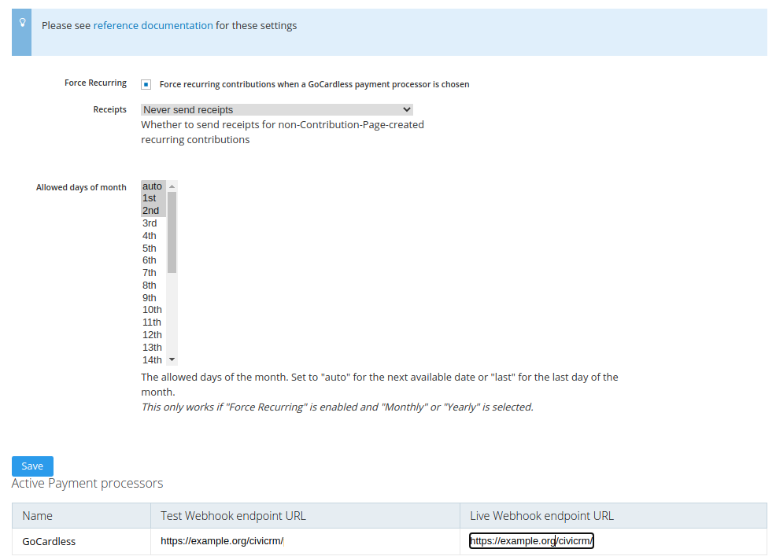

# Settings Page

## Force Recurring

- Default setting: `false` (off)
- JSON key: `forceRecurring`

CiviContribute's Contribution Pages allow you to *offer* recurring
payments. And if using the Membership sections then they may give a choice
on auto-renew. **But GoCardless requires payments to be recurring.**

Enabling this setting will add Javascript to Contribution Pages that
ensures the recurring/renew checkbox is checked whenever a GoCardless
payment processor is selected.

**If you do not have another solution in place, you should enable this
setting to prevent failed mandates and frustrated supporters.** You may
enable it anyway, but you should test that it works with whatever other
custom Javascript you have running on your page.

!!! warning
    If you offer GoCardless with a membership that doesn't support auto-renew
    you’re in trouble: if you use this option then it will become
    auto-renewing; if you don't use this option, well then it’s going to crash
    because this GoCardless integration only offers recurring.

## Send receipts for payments set up by custom code

- Default setting: `never`
- Possible settings: `never` `always` `defer`
- JSON key: `sendReceiptsForCustomPayments`

If you use the normal, core Contribution Pages to set up all your Direct
Debits you can ignore this; it won't have any effect.

However, if you have your own custom forms that create recurring
contributions using the APIs provided in this extension, then this is
relevant.

When a Contribution Page creates a ContributionRecur record, it copies its
email receipting configuration to the ContributionRecur's
`is_email_receipt`. That value will then be stored on the
ContributionRecur record and there's no way to change it.

When the API is used to create a payment, CiviCRM will:

1. see if `is_email_receipt` is provided in the API call's parameters. If
   it is, then its value will be used to decide the matter. Otherwise...

2. if the contribution is part of a recurring contribution, fetch the
   stored `is_email_receipt` value from the recurring contribution table.
   This defaults to 1 (i.e. yes)

However, if you create the ContributionRecur records yourself via the APIs
in some custom code, you might not have set this `is_email_receipt` value.

- `never` and `always` ignore the recurring contribution record's setting
  and will pass 0 or 1 into the payment APIs.

- `defer` will pass in the value from the recurring contribution record.

## Allowed days of the month

The allowed days of the month.
Set to "auto" for the next available date or "last" for the last day of the month.
You can specify multiple options and it will give the user a choice when setting up the payment.

This only works if "Force Recurring" is enabled and "Monthly" or "Yearly" is selected.

#### Developers notes
* The GoCardless API also supports specifying "month" for "Yearly subscriptions" but that is not currently implemented.
* The "Force recurring" setting is required because we are sharing the `gcform.js` code and it was simpler to implement that way.

